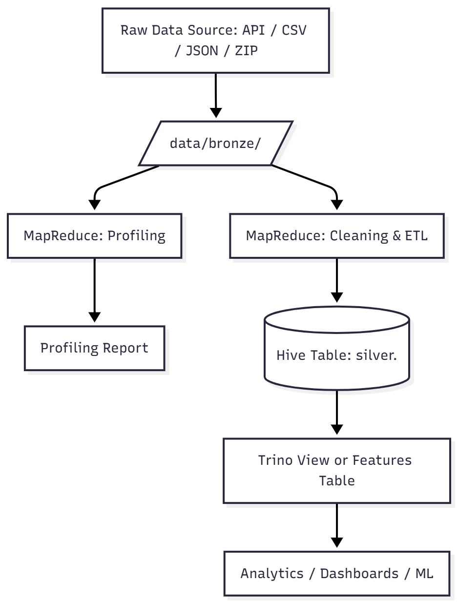

# Real-Time Big Data Analytics — Project Proposal

**Project Title:** Predicting FOMC (Fed) Decision Odds from Structured Markets & Macro Data
**Team Number:** 16

---

## Team

| Member          | NetID       |
| --------------- | ----------- |
| **Zephyr Luo**  | **zl3152**  |
| **Yushu LIU**   | **yl13841** |
| **Feifan Yang** | **fy2288**  |
| **Mark Chen**   | **jc10691** |

---

## Problem Statement & Goal

We will build a **hybrid real-time** analytics system that estimates and explains minute-level changes in the **December FOMC decision odds** (e.g., hold vs. cut/hike) by joining:

- **Prediction market probabilities** (Polymarket outcome tokens, Kalshi event contracts; optional WebSocket for sub-minute updates),
- **Equity & rates market signals** (S&P 500, VIX volatility, Treasury yields, Fed futures from yfinance),
- **Structured macro features** (FRED: CPI, unemployment, GDP, effective federal funds rate, target range),
- **Large-scale news intensity** (GDELT Events/Mentions; 15-minute cadence).

**Outputs:** a calibrated probability series, latency-to-move metrics around macro releases, and attributions of what moved the odds (prediction market shifts, equity/VIX reactions, rates curve movements, FRED macro updates, news bursts).

## Expected Insights

By combining prediction markets (Polymarket, Kalshi), equity/rates markets (yfinance), macro fundamentals (FRED), and news signals (GDELT), we aim to uncover:

- How quickly and strongly markets react to new macroeconomic information.

- Which indicators (e.g., CPI, unemployment, 10Y yields) most influence shifts in rate-cut expectations.

- The lag between real-world data releases and market repricing ("policy anticipation gap").

- Insights useful to policy analysts, investors, and traders monitoring Fed sentiment in real time.

---

## Data Sources, Ownership, Size, and Links

_All raw goes to `/data/bronze` (CSV/JSON/ZIP); cleaned analytics tables go to `/data/silver` (Parquet+Snappy, UTC, partitioned); final features to `/data/gold`._

| #   | Dataset (link)                                                                                                                                                                                                                                                          | What we use it for                                                                                                                                                      | Cadence                                 |                 Est. size (our 4–8 week window) | Owner (MR profiling & cleaning) |
| --- | ----------------------------------------------------------------------------------------------------------------------------------------------------------------------------------------------------------------------------------------------------------------------- | ----------------------------------------------------------------------------------------------------------------------------------------------------------------------- | --------------------------------------- | ----------------------------------------------: | ------------------------------- |
| 1   | **Polymarket – "Fed decision in December"**: Event page `polymarket.com/event/fed-decision-in-december`; Link=>docs.polymarket.com/developers/CLOB/timeseries; APIs: `gamma-api.polymarket.com` (market by slug) & `clob.polymarket.com` (prices-history, book, trades) | Outcome-token **price ≈ probability**; order book (spreads/depth); trades (impact)                                                                                      | Sec–min (poll or WS); backfill via REST | **GBs+** (book snapshots every 10–15s + trades) | **Zephyr Luo**                  |
| 2   | **Kalshi – Fed Rate Decision Markets**: [https://kalshi.com](https://kalshi.com); API: `api.elections.kalshi.com`                                                                                                                                                       | Event-based prediction market probabilities for Fed rate decisions                                                                                                      | Real-time (REST API)                    |                                         **MBs** | **Zephyr Luo**                  |
| 3   | **Yahoo Finance (yfinance) – S&P 500 & Macro Market Indicators**: [https://finance.yahoo.com](https://finance.yahoo.com); Python package: `yfinance`                                                                                                                    | Stock market indices (S&P 500, NASDAQ, Dow Jones), sector ETFs, VIX volatility index, Treasury yields (10Y/5Y/3M), Fed funds futures, and other equity/macro indicators | Daily / Intraday                        |                                  **100s of MB** | **Mark Chen**                   |
| 4   | **GDELT (Global Database of Events, Language, and Tone)**: [https://www.gdeltproject.org](https://www.gdeltproject.org); API: `api.gdeltproject.org`                                                                                                                    | Large-scale news intensity and sentiment related to Federal Reserve, FOMC, rate decisions                                                                               | 15-minute cadence                       |                                         **GBs** | **Feifan Yang**                 |
| 5   | **FRED (Federal Reserve Economic Data)**: [https://fred.stlouisfed.org](https://fred.stlouisfed.org); API: `api.stlouisfed.org/fred/series/observations`                                                                                                                | Core macroeconomic indicators — CPI, unemployment, GDP, Fed funds rate, 10Y yield, and target range upper/lower limits                                                  | Daily / Monthly (series-dependent)      |                                         **MBs** | **Yushu LIU**                   |

> We combine **Polymarket & Kalshi** (prediction markets) with **FRED** (macroeconomic fundamentals), **yfinance** (equity & rates markets), and **GDELT** (large-scale news signals) to create a comprehensive real-time analytics system.

---

## Schemas & Formats (Silver / analytics-ready)

**All timestamps in UTC. Partition by `dt=YYYY-MM-DD` and `hour=HH` for time-series.**

### Polymarket

- `silver.polymarket_prices_history(token_id STRING, ts TIMESTAMP, price_cents DOUBLE, probability DOUBLE, dt STRING, hour STRING)`
- `silver.polymarket_book_top(token_id STRING, ts TIMESTAMP, best_bid_price DOUBLE, best_bid_size DOUBLE, best_ask_price DOUBLE, best_ask_size DOUBLE, spread DOUBLE, dt STRING, hour STRING)`
- `silver.polymarket_trades(ts TIMESTAMP, token_id STRING, side STRING, price DOUBLE, size DOUBLE, tx_hash STRING, dt STRING, hour STRING)`

### Kalshi

- `silver.kalshi_trades(ts TIMESTAMP, market_ticker STRING, side STRING, price DOUBLE, count INT, dt STRING, hour STRING)`
- `silver.kalshi_orderbook(market_ticker STRING, ts TIMESTAMP, yes_bid DOUBLE, yes_ask DOUBLE, no_bid DOUBLE, no_ask DOUBLE, dt STRING, hour STRING)`

### Yahoo Finance (yfinance)

- `silver.yfinance_equity(ticker STRING, date DATE, open DOUBLE, high DOUBLE, low DOUBLE, close DOUBLE, adj_close DOUBLE, volume BIGINT)`
- `silver.yfinance_rates(ticker STRING, date DATE, close DOUBLE)` -- Treasury yields, Fed futures
- `silver.yfinance_vix(date DATE, open DOUBLE, high DOUBLE, low DOUBLE, close DOUBLE, volume BIGINT)`

**MapReduce profiling & cleaning (Mark Chen)**

- Profiling code lives in `mapreduce/yfinance_profile_mapper.py` and `mapreduce/yfinance_profile_reducer.py` (Hadoop Streaming / Python). It emits ticker-level stats such as row counts, min/max dates, average price, and missing-field counts.  
- Cleaning/deduping logic lives in `mapreduce/yfinance_clean_mapper.py` and `mapreduce/yfinance_clean_reducer.py`, which normalize the CSVs, flag data quality issues, and deduplicate on `(ticker, date, series_label)` before writing a harmonized output schema.  
- Re-run the jobs on the NYU Hadoop cluster using the commands in `docs/mapreduce_commands_yfinance.md`. Remember to upload the raw CSVs to HDFS and capture your shell session log for submission.  
- A 3M treasury-bill snippet for the PDF report is staged at `docs/samples/yfinance_3m_treasury_bill_sample.csv`; do not include the full dataset in your deliverable.

### GDELT (selected fields; wide → trimmed)

- `silver.gdelt_articles(dt STRING, hour STRING, article_id STRING, url STRING, title STRING, domain STRING, language STRING, sourcecountry STRING, tone DOUBLE, seendate_parsed TIMESTAMP, ts_utc TIMESTAMP)`
- `gold.gdelt_features(ts TIMESTAMP, article_count INT, unique_domains INT, avg_tone DOUBLE, tone_std DOUBLE, news_shock DOUBLE, top_domains STRING, top_countries STRING, dt STRING, hour STRING)`

### FRED

- `silver.fred(series_id STRING, date DATE, value DOUBLE, series_label STRING)`

Each CSV corresponds to one macro series, e.g.:

```bash
fred_cpi_all_items.csv
fred_unemployment_rate.csv
fred_real_gdp.csv
fred_effective_fed_funds_rate.csv
fred_treasury_10y_yield.csv
fred_target_range_upper.csv
fred_target_range_lower.csv
```

---

## Software Architecture (Big Data Tools)

## Design Diagram



### GDELT Data Pipeline

```
┌─────────────────────────────────────────────────────────────────────────────┐
│                           GDELT Data Pipeline                                │
├─────────────────────────────────────────────────────────────────────────────┤
│                                                                             │
│   ┌─────────────┐      ┌─────────────┐      ┌─────────────┐                │
│   │   GDELT     │      │   Bronze    │      │   Silver    │                │
│   │  DOC 2.0    │ ───► │    Layer    │ ───► │    Layer    │                │
│   │    API      │      │  (Raw CSV)  │      │  (Parquet)  │                │
│   └─────────────┘      └─────────────┘      └─────────────┘                │
│         │                    │                    │                         │
│         │                    │                    │                         │
│         ▼                    ▼                    ▼                         │
│   Rate Limiting:      market_data/         data/silver/gdelt/              │
│   - 15min incremental    gdelt/            dt=YYYY-MM-DD/                  │
│   - 5s between queries   ├── gdelt_*.csv   hour=HH/                        │
│   - Exponential backoff  └── metadata.json └── articles.parquet            │
│                                                                             │
│                              │                    │                         │
│                              └────────┬───────────┘                         │
│                                       │                                     │
│                                       ▼                                     │
│                              ┌─────────────┐                                │
│                              │    Gold     │                                │
│                              │   Layer     │                                │
│                              │ (Features)  │                                │
│                              └─────────────┘                                │
│                                       │                                     │
│                                       ▼                                     │
│                              data/gold/gdelt_features/                      │
│                              ├── gdelt_features.parquet                     │
│                              ├── gdelt_features.csv                         │
│                              └── gold_metadata.json                         │
│                                                                             │
│   Features (15-min window):                                                 │
│   - article_count, unique_domains                                          │
│   - avg_tone, tone_std, tone_min/max                                       │
│   - news_shock (z-score spike indicator)                                   │
│   - top_domains, top_countries                                             │
│   - ts (UTC aligned for cross-source join)                                 │
│                                                                             │
└─────────────────────────────────────────────────────────────────────────────┘
```

---

## Usage

### Quick Start

```bash
# Install dependencies
pip install -r requirements.txt

# Download all data sources (Polymarket + Kalshi + Yahoo Finance + GDELT + FRED)
python fetch_data.py
```

### Set Up Environment Variables

Create a file named .env in the project root (RDBA/.env):

```bash
FRED_API_KEY=your_fred_api_key_here
```

You can register for a free key here: https://fred.stlouisfed.org/docs/api/fred/

### Download Specific Sources

```bash
# Individual sources
python fetch_data.py -p          # Polymarket only
python fetch_data.py -k          # Kalshi only
python fetch_data.py -y          # Yahoo Finance only
python fetch_data.py -g          # GDELT news only (incremental 15min)
python fetch_data.py -f          # FRED only

# Multiple sources
python fetch_data.py -p -k       # Polymarket + Kalshi
python fetch_data.py -g -y       # GDELT + Yahoo Finance

# By source name
python fetch_data.py --source gdelt

# Custom FRED fetch
python fetch_data.py -f --fred-series CPIAUCSL,UNRATE,FEDFUNDS
python fetch_data.py -f --fred-start 2010-01-01

# List all available sources
python fetch_data.py --list
```

### GDELT-Specific Commands

```bash
# Incremental fetch (default 15-minute window)
python fetch_data.py -g

# Custom timespan for incremental fetch
python fetch_data.py -g --gdelt-timespan 1h      # 1 hour window
python fetch_data.py -g --gdelt-timespan 1d      # 1 day window

# Backfill historical data (date range)
python fetch_data.py --gdelt-backfill 2024-11-01 2024-11-30

# Full pipeline: Bronze -> Silver -> Gold
python fetch_data.py --gdelt-pipeline

# Process existing bronze data to silver layer
python fetch_data.py --gdelt-silver

# Compute gold layer features from silver data
python fetch_data.py --gdelt-gold

# Custom max records per query
python fetch_data.py -g --gdelt-maxrecords 500
```

### GDELT Rate Limiting & Retry Guidelines

The GDELT DOC 2.0 API has rate limits. Follow these guidelines:

| Scenario | Recommendation |
|----------|----------------|
| **Real-time monitoring** | Use `--gdelt-timespan 15min`, run every 15 minutes |
| **Hourly updates** | Use `--gdelt-timespan 1h`, run every hour |
| **Daily batch** | Use `--gdelt-timespan 1d`, run once daily |
| **Historical backfill** | Use `--gdelt-backfill START END`, automatically batched |

**Rate Limit Handling:**
- If you receive a 429 error, the system will automatically retry with exponential backoff (10s, 20s, 40s, 80s, up to 120s)
- Between queries, the system waits 5 seconds automatically
- If rate limited repeatedly, wait 10-30 minutes before retrying
- For large backfills, consider running overnight or during off-peak hours

**Retry Configuration (in `data_sources/gdelt.py`):**
```python
RATE_LIMIT_CONFIG = {
    "initial_backoff_sec": 10,    # Initial wait after 429
    "max_backoff_sec": 120,       # Maximum wait time
    "backoff_multiplier": 2,      # Exponential backoff factor
    "between_query_wait_sec": 5,  # Wait between queries
    "max_retries": 5,             # Maximum retry attempts
}
```

### Output Structure

The script creates `market_data/` directory and writes CSV exports plus metadata:

- `market_data/polymarket/` - Polymarket prediction market data (trades, orderbook, probabilities)
- `market_data/kalshi/` - Kalshi prediction market data (event contracts, trades)
- `market_data/yfinance/` - Stock market data (S&P 500, NASDAQ, Dow Jones, VIX, sector ETFs, Treasury yields, Fed futures)
- `market_data/gdelt/` - GDELT news articles and events (Federal Reserve, FOMC, rate decision related)
  - `gdelt_combined_latest.csv` - Latest combined articles
  - `gdelt_combined_YYYYMMDD_HHMMSS.csv` - Timestamped snapshots
  - `gdelt_metadata.json` - Fetch metadata and statistics
- `market_data/fred/` - FRED macroeconomic data (CPI, unemployment, GDP, effective Fed funds rate, target range, and other key economic indicators)

**Silver Layer Output:**
- `data/silver/gdelt/dt=YYYY-MM-DD/hour=HH/articles.parquet` - Cleaned, partitioned Parquet files

**Gold Layer Output:**
- `data/gold/gdelt_features/gdelt_features.parquet` - Aggregated features
- `data/gold/gdelt_features/gdelt_features.csv` - CSV for inspection
- `data/gold/gdelt_features/gold_metadata.json` - Feature computation metadata

### Customizing Data Sources

Edit configuration constants in each data source module:

- **Polymarket**: `data_sources/polymarket.py` - Update `EVENT_SLUG` and `MARKET_LABELS` for different Fed decision events
- **Kalshi**: `data_sources/kalshi.py` - Update `MARKET_TICKERS` to track specific Fed rate decision contracts
- **Yahoo Finance**: `data_sources/yfinance.py` - Update `TICKERS` to include desired equity indices (^GSPC, ^IXIC, ^DJI, ^VIX), sector ETFs (XLF, XLK, etc.), Treasury yields (^TNX, ^FVX), and Fed futures; adjust `DEFAULT_START`, `INTERVAL` for historical range and frequency
- **GDELT**: `data_sources/gdelt.py` - Update `DEFAULT_QUERIES` with Fed/FOMC-related keywords, `DEFAULT_PARAMS` (timespan, maxrecords), and `RATE_LIMIT_CONFIG` for retry behavior
- **FRED**: `data_sources/fred.py` - Update `SERIES` (series IDs like CPIAUCSL, UNRATE, GDPC1, FEDFUNDS) and .env for `FRED_API_KEY`; adjust date range or output directory

### GDELT Default Queries

The following Fed/FOMC-related queries are enabled by default:

```python
DEFAULT_QUERIES = {
    "fed_fomc": '("Federal Reserve" OR "FOMC" OR "Fed meeting" OR "Fed decision")',
    "rate_decision": '("rate cut" OR "rate hike" OR "interest rate" OR "rate decision")',
    "fed_officials": '("Jerome Powell" OR "Powell" OR "Fed Chair" OR "Fed governor")',
    "monetary_policy": '("monetary policy" OR "quantitative easing" OR "hawkish" OR "dovish")',
}
```

Additional queries available (enable in `ADDITIONAL_QUERIES`):
- `inflation_fed`: Federal Reserve + inflation/CPI/PCE
- `employment_fed`: Federal Reserve + employment/labor market
- `treasury_market`: Treasury yields and bond market
- `fed_balance_sheet`: Balance sheet, QT, asset purchases

### Using in Python Code

```python
from data_sources import kalshi, polymarket, yfinance, gdelt, fred

# Export from individual sources
kalshi.export_data()
polymarket.export_data()
yfinance.export_data()
gdelt.export_data()
fred.export_data()

# GDELT incremental fetch (default 15min)
gdelt.export_data()

# GDELT with custom parameters
gdelt.export_data(
    queries={"fed_decision": '("Federal Reserve" OR FOMC OR "rate cut")'},
    timespan="1h",
    maxrecords=250
)

# GDELT backfill historical data
gdelt.backfill_data(
    start_date="2024-11-01",
    end_date="2024-11-30",
    batch_hours=24
)

# GDELT full pipeline (Bronze -> Silver -> Gold)
gdelt.run_full_pipeline(timespan="1h", compute_features=True)

# GDELT silver layer processing
gdelt.process_to_silver()

# GDELT gold layer features
features_df = gdelt.compute_gold_features(window_minutes=15)

# Get GDELT features aligned for cross-source joins
from datetime import datetime
aligned_features = gdelt.get_aligned_features(
    start_ts=datetime(2024, 11, 1),
    end_ts=datetime(2024, 11, 30),
    window_minutes=15
)

# Create enhanced news shock features for ML models
enhanced_features = gdelt.create_news_shock_features(
    features_df,
    lookback_windows=[1, 4, 12, 24]  # 15min, 1h, 3h, 6h
)

# Or use convenience function
from data_sources import export_all
export_all(['kalshi', 'polymarket', 'gdelt', 'fred'])
```

### Cross-Source Data Fusion

GDELT features are designed to join with other data sources using UTC-aligned timestamps:

```python
import pandas as pd
from data_sources import gdelt

# Get GDELT features (15-min windows, UTC aligned)
gdelt_features = gdelt.get_aligned_features(window_minutes=15)

# The 'ts' column is the join key (UTC timestamp floored to 15-min window)
# Join with other sources:
# - Polymarket: join on ts (floor to 15min)
# - yfinance: join on date (for daily data) or ts (for intraday)
# - FRED: join on date

# Example: Create combined feature set
combined = pd.merge(
    gdelt_features[['ts', 'article_count', 'avg_tone', 'news_shock']],
    other_source_df,
    on='ts',
    how='outer'
)

# Key GDELT features for models:
# - article_count: News intensity (activity level)
# - unique_domains: Source diversity
# - avg_tone: Average sentiment (-100 to +100 scale)
# - news_shock: Z-score of article count (spike indicator)
# - tone_std: Sentiment volatility
```

### Running Tests

```bash
# Run GDELT unit tests
pytest tests/test_gdelt.py -v

# Run with coverage
pytest tests/test_gdelt.py --cov=data_sources.gdelt -v
```

---

## NYU HPC Setup (GB-Scale Data Collection)

For collecting GB-scale GDELT data, we recommend using NYU HPC (Greene cluster).

### Quick Setup

1. **Connect VSCode to HPC:**
   - Install "Remote - SSH" extension in VSCode
   - Add to `~/.ssh/config`:
     ```
     Host nyu-hpc
         HostName greene.hpc.nyu.edu
         User YOUR_NETID
     ```
   - Press F1 → "Remote-SSH: Connect to Host" → select `nyu-hpc`

2. **Initial Setup on HPC:**
   ```bash
   cd /scratch/$USER
   git clone <your-repo-url> RDBA
   cd RDBA

   module load python/intel/3.8.6
   python -m venv venv
   source venv/bin/activate
   pip install -r requirements.txt
   ```

3. **Run Quick Start Script:**
   ```bash
   chmod +x scripts/hpc/quick_start.sh
   ./scripts/hpc/quick_start.sh
   ```

### Submit GB-Scale Fetch Job

```bash
# Edit email in sbatch file first
vim scripts/hpc/submit_gdelt_fetch.sbatch

# Submit job (6 months of data, ~500MB - 1GB)
sbatch scripts/hpc/submit_gdelt_fetch.sbatch

# Check job status
squeue -u $USER

# View logs
tail -f logs/gdelt_fetch_*.out
```

### Data Analysis

```bash
# Run analysis on collected data
python scripts/analyze_gdelt.py \
    --input market_data/gdelt/bulk_6months \
    --output analysis_output

# Or submit as batch job
sbatch scripts/hpc/submit_analysis.sbatch
```

### HPC File Structure

```
/scratch/YOUR_NETID/RDBA/
├── scripts/hpc/
│   ├── setup_hpc.md              # Detailed setup guide
│   ├── quick_start.sh            # Interactive setup script
│   ├── submit_gdelt_fetch.sbatch # 6-month data fetch job
│   └── submit_analysis.sbatch    # Data analysis job
├── market_data/gdelt/
│   └── bulk_6months/             # GB-scale raw data
├── data/
│   ├── silver/gdelt/             # Cleaned Parquet data
│   └── gold/gdelt_features/      # Feature data
└── analysis_output/              # Analysis results
```

### Estimated Data Sizes

| Duration | Articles | File Size |
|----------|----------|-----------|
| 7 days   | ~10,000  | ~10-20 MB |
| 30 days  | ~50,000  | ~50-100 MB |
| 3 months | ~150,000 | ~200-500 MB |
| 6 months | ~300,000 | ~500 MB - 1 GB |

For detailed HPC instructions, see [scripts/hpc/setup_hpc.md](scripts/hpc/setup_hpc.md).
